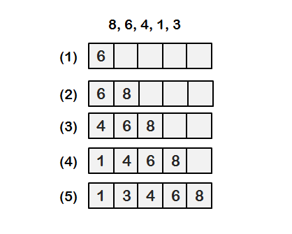
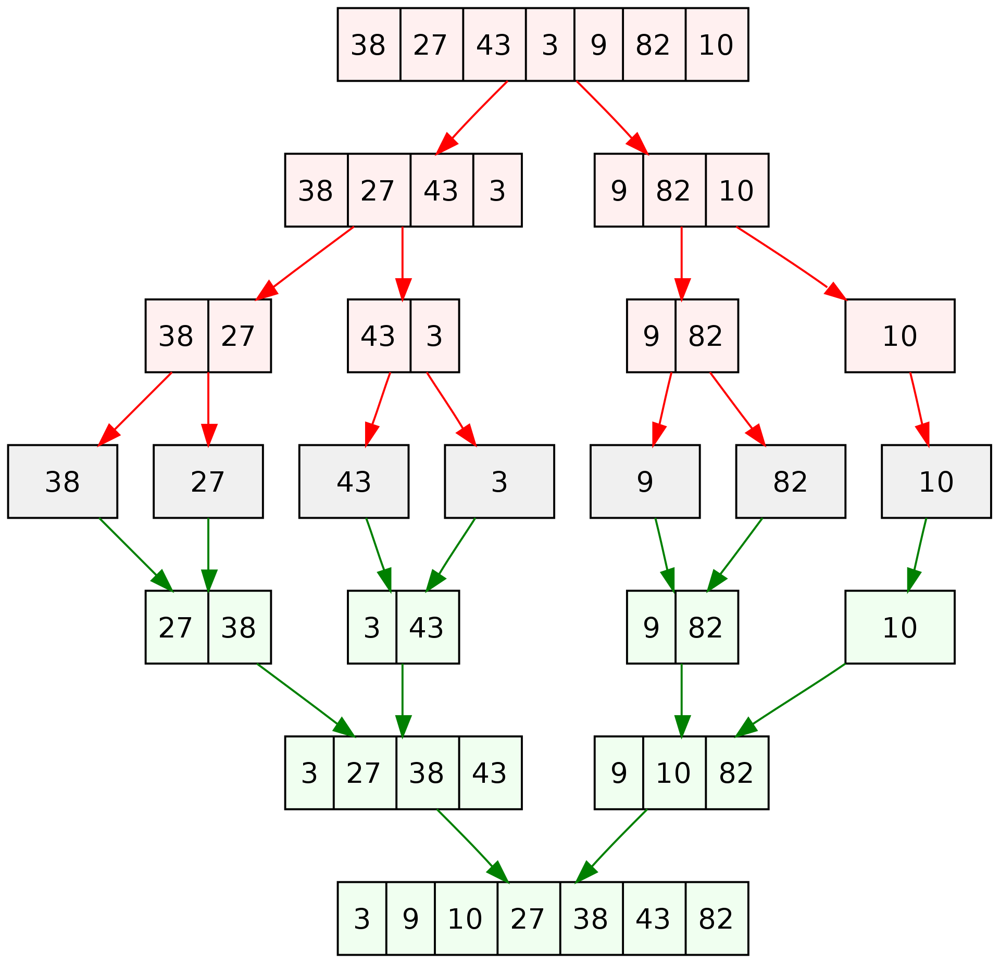
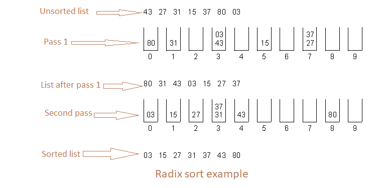
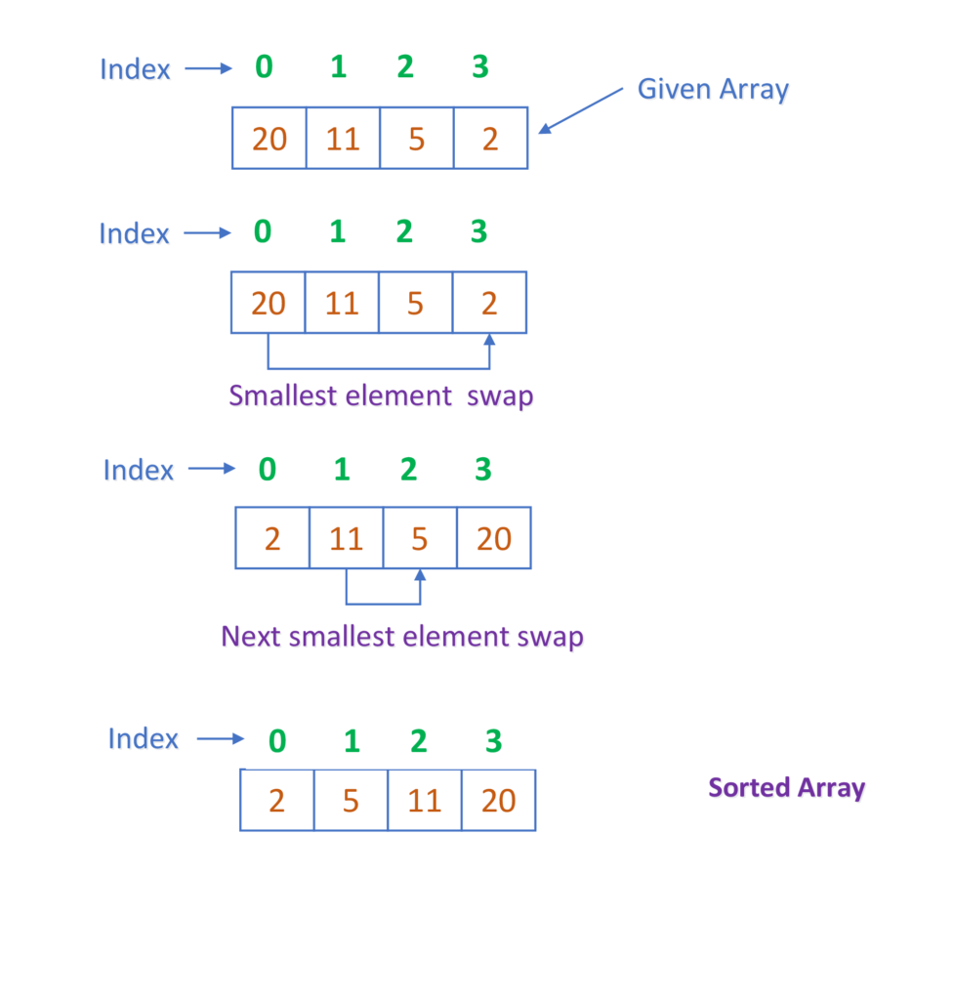

<h2 align="center">Algorithms</h2>

------------

   
Table of Contents

   <ol>
      <li>
        <a href="#sorting-algo">Sorting algorithms</a>
      </li>

- [Bubble sort](#bubble-sort)
- [Insertion sort](#insertion-sort)
- [Merge sort](#merge-sort)
- [Quick sort](#quick-sort)
- [Radix sort](#radix-sort)
- [Selection sort](#selection-sort)
- [Time complexity comparison](#time-complexity-comparison)

</ul>     
  </ol>

## About

Algorithms implemented in Java and Python for self study.

--------

  
Sorting algorithms

These algorithms are used to rearrange elements of a given array or list into order.

## Bubble sort
Works by swapping one element with the one next to it if the element if bigger till the array is ordered.

Example image:

Steps:
1. Get an item.
1. Compare with the one on the right. 
1. Swap item until it's in the correct order.
1. Get next item and repeat the steps.

#### **Run time**
O(n^2)

[see code in Python](python/sorting/bubble_sort.py) | [see code in Java](java/sorting/_sort.java)

## Insertion sort
Simple sort algorithm that split a list into a sorted and an usorted parts. More useful for small data sets, uses nested loops to sort.

Example image:

Steps:
1. Iterate from arr[1] to arr[n].
1. Compare the current item to the one on it's left.
1. If the current item is smaller continue to compare it to the items on the left until reaches correct spot.
1. Insert the current item in place.

#### **Run time**
O(n^2)

[see code in python](python/sorting/insertion_sort.py) | [see code in Java](java/sorting/insertion_sort.java)

## Merge sort

Is a divide-and-conquer algorithm that divides the array into smaller arrays and then merge those into a ordered one. Efficient in large data sets.

Exemple image:

Steps:
1. Divide the array into sub-arrays
1. Recursively divite the sub-arrays until it reaches an array with a single item.
1. Compare the items and merge into a array.
1. Merge the sub-arrays until there's no array left.

#### **Run time**
O(n log(n))

[see code in Python](python/sorting/merge_sort.py) | [see code in Java](java/sorting/insertion_sort.java)

## Quick sort
Is a divide-and-conquer algorithm that picks a pivot separate the array around the pivot with one side the elements that are lesser than the pivot and the other side the elements that are greater than the pivot. Efficient in large data sets.

Exemple image:

Steps:

1. Chose the pivot, in the exemple the last element was picked.
1. Compare the rest of the array with the pivot.
1. Separate the lower values to the left and the bigger values to the right.
1. Swap the pivot to the right place.
1. Recursivaly repeat the steps in the sub lists until every thing is in place.

#### **Run time**
O(n^2)

[see code in Python](python/sorting/quick_sort.py) | [see code in Java](java/sorting/insertion_sort.java)

## Radix sort
Radix sort by comparing each index of an item from the most right to the left, separates each item in the corresponded bucket. Uses nested lists. 

Example image:

Steps:

1. Create ten lists inside a list to represent the ten digits(0 to 9).
1. Put the items in the correct list or bucket.
1. repeat till last digit on the biggest number is soted
1. Flatten the lists into a single list

#### **Run time**
O(nk)

[see code in Python](python/sorting/radix_sort.py) | [see code in Java](java/sorting/radix_sort.java)

## Selection sort
Algorithm that separates the array into a unsorted and a sorted part and keeps finding the smallest item on the array and swap to the first position. Not very fast, uses nested loops.

Exemple image:

Steps:

1. Iterate through the unsorted part of the list
1. Find the minimum item in the array
1. Swap the minimun item with the first item in the unsorted part of the list.

#### **Run time**
O(n^2)

[see code in Python](python/sorting/selection_sort.py) | [see code in Java](java/sorting/insertion_sort.java)

--------- 
## Time complexity comparison 

algorithm       | Best         | Average     | worst   
-----           |   ---------  | ---------   | --------
Quick sort      | Ω(n log(n))  | Θ(n log(n)) | O(n^2)
Merge sort      | Ω(n log(n))  | Θ(n log(n)) | O(n log)
Bubble sort     | Ω(n)         | Θ(n^2)      | O(n^2)
Insertion sort  | Ω(n)         | Θ(n^2)      | O(n^2)
Selection sort  | Ω(n^2)       | Θ(n^2)      | O(n^2)
Radix sort      | Ω(n+k)       | Θ(n+k)      | O(nk)

